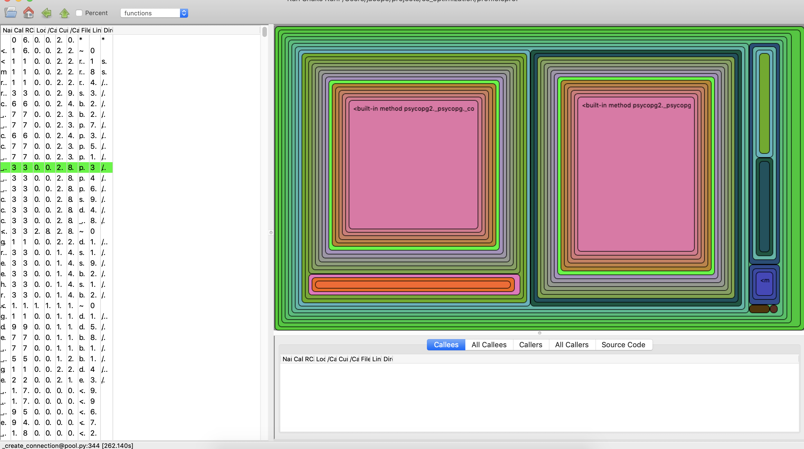

## Snakerunner

This is a fork of the seemingly discontinued [RunSnakeRun], ported to Python3.

Snakerunner is a GUI viewer for Python profiling runs. It provides exorability
and overall visualization of the call tree and package/module structures.


### Status

Porting to Python3 is finished and it works on MacOS. There are some problems on
Linux due to some gtk3 library issues.

This is a fork from a fairly old project, so the codebase is not very polished
and up to current best practices and standards.


### Requirements

* Python: 3.7+
* wxPython: 4.2+


### Modifications since the Fork

* Python3 compatibility
* Updated to current wxpython version
* Merged `squaremap` library into the project
* Removed support for Meliae memory profiling
* Modernized setup.py
* Replaced SafeConfigParser with ConfigParser
* Replaced logger.warn with logger.warning

[RunSnakeRun]: http://www.vrplumber.com/programming/runsnakerun/

### Start

```shell
python -m snakerunner 
```

### Screenshot


